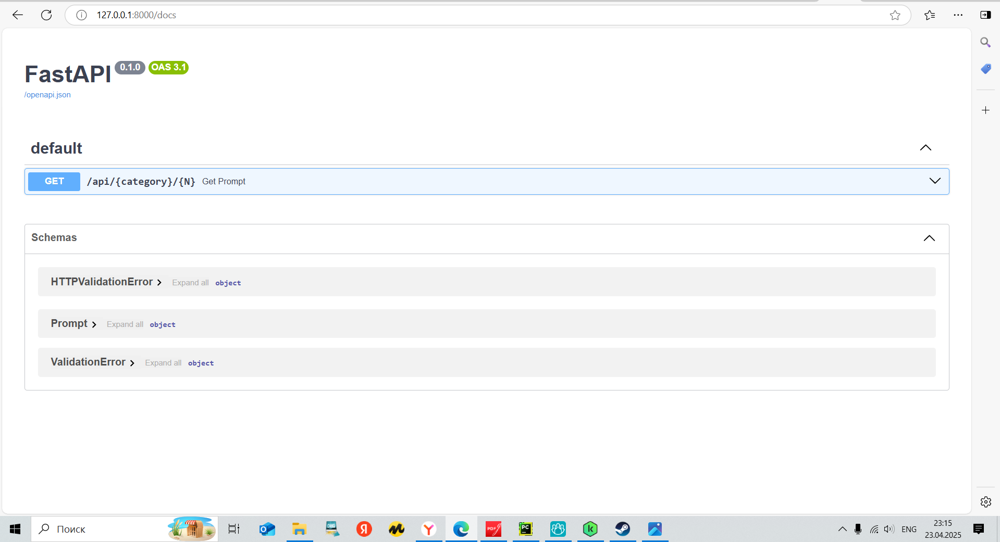

# API для сайта https://promptbase.com/

## Используемые технологии
В данном проекте были использованы следующие технологии: <b>FastAPI, Selenium, BeautifulSoup</b>

##  Установка

1. Клонируйте репозиторий:
   ```bash
   git clone https://github.com/Ostap2002-arch/API_promptbase.git
   ```
   После установки проекта перейдите в него
2. Установите библиотеки
     ```bash
       pip install -r requirements.txt
   ```
##  Настройка .env файла
Создайте файл .env в корне проекта с содержимым:
   ```bash
   URL=https://promptbase.com/
   ```
## Запуск FastAPI
   ```bash
   uvicorn main:app --reload
   ```
После запуска перейдите на адресс http://127.0.0.1:8000/docs, если все сделано правильно,
то вы увидите:



Тут вы можете ознакомиться с аргументами передаваемыми API и в каком формате он возвращает
ответ.

## Пример работы

Endpoin принимает в агрументы следующие переменные:
* category - категорию промтов
* N - кол-во возвращаемых промтов

Пусть мы для примера посмотрим первые 2 промта по катеории 'Graphics'


Посмотри информацию о самом первом промте


Отравим запрос к нашему API 


Как мы видим, данные совпадают. Важно отметить, что превью передается в формате <b>bytes64</b>

## Дополнительная защита
При попытке обратиться к несуществуемой категории будет возвращена ошибка с информацией


